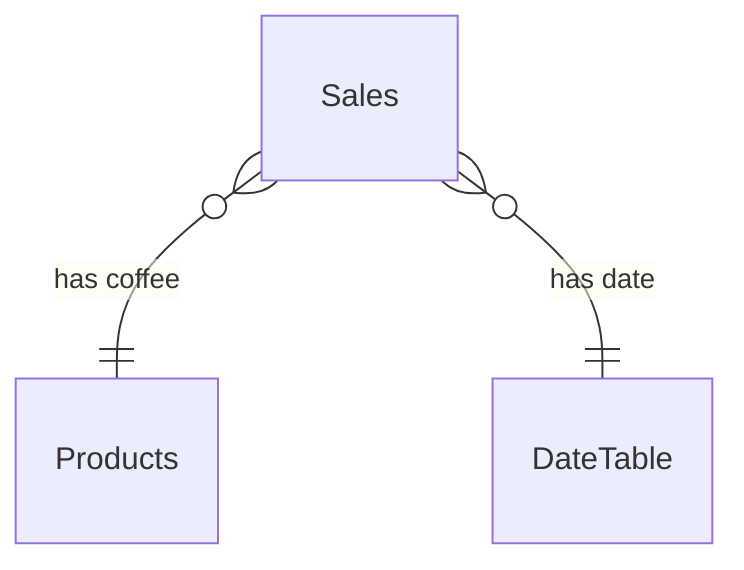

# Coffee Sales Dashboard — Data Dictionary

## Tables & Relationships

```
Sales (fact)  * ── 1 Products (dimension)
Sales (fact)  * ── 1 DateTable (calculated, marked as date table)
```

### Mermaid ER Diagram



## Files

| File | Rows | Description |
| --- | --- | --- |
| `data/coffee_sales.csv` | 3,636 | One row per order line (coffee sale). |
| `data/coffee_products.csv` | 8 | Coffee menu with price and description. |
| `data/payment_methods.csv` | 2 | Card / Cash lookup. |

## Field Definitions

### coffee_sales.csv (Sales table)

| Field | Type | Description |
| --- | --- | --- |
| OrderID | Text | Unique order identifier (synthetic). |
| OrderDate | Date | Date of the transaction. |
| CoffeeName | Text | FK → `coffee_products.CoffeeName`. |
| Quantity | Integer | Number of cups sold in the transaction. |
| UnitPrice | Currency | Price per cup at time of sale. |
| TotalAmount | Currency | `UnitPrice × Quantity`. |
| PaymentMethod | Text | `Card` or `Cash`. |

### coffee_products.csv (Products table)

| Field | Type | Description |
| --- | --- | --- |
| CoffeeID | Text | PK. |
| CoffeeName | Text | Display name; matches `Sales.CoffeeName`. |
| Category | Text | `Espresso Based` or `Non-Espresso`. |
| UnitPrice | Currency | Standard menu price. |
| Description | Text | Short flavour/description. |

### payment_methods.csv

| Field | Type | Description |
| --- | --- | --- |
| PaymentMethod | Text | PK. |
| Description | Text | Explanation of the payment type. |

## Suggested DateTable (Power Query M)

```m
let
    Start = #date(2024, 3, 1),
    End   = #date(2025, 3, 31),
    Dates = List.Dates(Start, Duration.Days(End - Start) + 1, #duration(1,0,0,0)),
    Tbl   = Table.FromList(Dates, Splitter.SplitByNothing(), {"Date"}),
    #"Typed"    = Table.TransformColumnTypes(Tbl, {{"Date", type date}}),
    #"Year"     = Table.AddColumn(#"Typed",     "Year",     each Date.Year([Date]),       Int64.Type),
    #"Quarter"  = Table.AddColumn(#"Year",      "Quarter",  each Date.QuarterOfYear([Date]),Int64.Type),
    #"Month"    = Table.AddColumn(#"Quarter",   "Month",    each Date.Month([Date]),       Int64.Type),
    #"MonthName"= Table.AddColumn(#"Month",     "Month Name", each Date.MonthName([Date]), type text),
    #"Weekday"  = Table.AddColumn(#"MonthName", "Weekday",  each Date.DayOfWeekName([Date]),type text)
in
    #"Weekday"
```

Mark this table as the **Date table** in Power BI Model view.