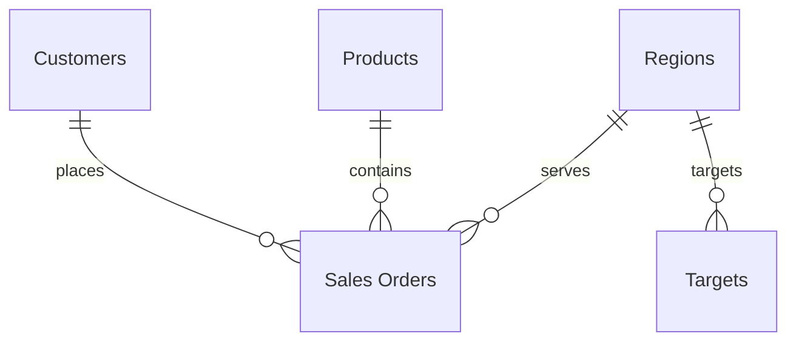

# Sales & Revenue Dashboard — Data Dictionary

Sample dataset built for a professional Power BI sales dashboard.
Every file lives under `data/`.

## Tables & Relationships

```
Customers 1 ── * Sales Orders * ── 1 Products
Regions   1 ── * Sales Orders
Regions   1 ── * Targets (Year, Region)
Date            (calculated calendar table, marked as date table)
```

Entity-relationship style (mermaid) view:



## Files

| File | Rows | Description |
| --- | --- | --- |
| `data/sales_orders.csv` | 2,200 | Fact table. One row per order line. |
| `data/products.csv` | 20 | Dimension. Product catalog with category, price and cost. |
| `data/customers.csv` | 40 | Dimension. Customer master with segment and geography. |
| `data/regions.csv` | 5 | Dimension. Sales regions and area managers. |
| `data/targets.csv` | 10 | Fact/lookup. Annual revenue targets by region (2024 & 2025). |

## Field definitions

### sales_orders.csv

| Field | Type | Description |
| --- | --- | --- |
| OrderID | Text | Unique order identifier (synthetic). |
| OrderDate | Date | Date the order was placed. |
| ShipDate | Date | Date the order was shipped. |
| ShipMode | Text | Shipping class: Standard Class, Second Class, First Class, Same Day. |
| CustomerID | Text | FK → `customers.CustomerID`. |
| CustomerState | Text | State/Province of the customer (2-letter). |
| Region | Text | FK → `regions.Region`. |
| ProductID | Text | FK → `products.ProductID`. |
| Quantity | Integer | Units sold. |
| UnitPrice | Currency | List price at time of sale. |
| Discount | Decimal | Discount rate 0–0.20 applied to the line. |
| SalesAmount | Currency | `UnitPrice × Quantity × (1 − Discount)`. |
| Profit | Currency | `SalesAmount − (UnitCost × Quantity)`. |

### products.csv

| Field | Type | Description |
| --- | --- | --- |
| ProductID | Text | PK. |
| ProductName | Text | Product display name. |
| Category | Text | High-level category: Technology, Furniture, Office Supplies. |
| SubCategory | Text | Granular category. |
| UnitPrice | Currency | Current selling price. |
| UnitCost | Currency | Cost to acquire/make. |

### customers.csv

| Field | Type | Description |
| --- | --- | --- |
| CustomerID | Text | PK. |
| CustomerName | Text | Company or individual name. |
| Segment | Text | Consumer, Corporate, Home Office, Education, Healthcare. |
| Country | Text | Country. |
| City | Text | City. |
| State | Text | State/Province (2-letter; Canadian provinces too). |

### regions.csv

| Field | Type | Description |
| --- | --- | --- |
| RegionID | Text | PK. |
| Region | Text | Region name: North, South, East, West, Central. |
| AreaManager | Text | Manager accountable for the region. |

### targets.csv

| Field | Type | Description |
| --- | --- | --- |
| Year | Integer | Target year (2024, 2025). |
| Region | Text | FK → `regions.Region`. |
| TargetAmount | Currency | Revenue target for that region/year. |

## Suggested date table (Power Query M)

```m
let
    StartDate = #date(2024, 1, 1),
    EndDate = #date(2025, 12, 31),
    Dates = List.Dates(StartDate, Duration.Days(EndDate - StartDate) + 1, #duration(1, 0, 0, 0)),
    Table = Table.FromList(Dates, Splitter.SplitByNothing(), {"Date"}),
    #"Changed Type" = Table.TransformColumnTypes(Table, {{"Date", type date}}),
    #"Added Year" = Table.AddColumn(#"Changed Type", "Year", each Date.Year([Date]), Int64.Type),
    #"Added Quarter" = Table.AddColumn(#"Added Year", "Quarter", each Date.QuarterOfYear([Date]), Int64.Type),
    #"Added Month" = Table.AddColumn(#"Added Quarter", "Month", each Date.Month([Date]), Int64.Type),
    #"Added Month Name" = Table.AddColumn(#"Added Month", "Month Name", each Date.MonthName([Date]), type text),
    #"Added Weekday" = Table.AddColumn(#"Added Month Name", "Weekday", each Date.DayOfWeekName([Date]), type text)
in
    #"Added Weekday"
```